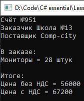

# Lesson2_task4
Условия задачки:
>Используя Visual Studio, создайте проект по шаблону Console Application.  
Требуется:  
Создать класс Invoice. 
В теле класса создать три поля int account, string customer, string provider которые должны быть проинициализированы один раз (при создании экземпляра данного класса) без возможности их дальнейшего изменения. 
В теле класса создать два закрытых поля string article, int quantity 
Создать метод расчета стоимости заказа с НДС и без НДС. 
Написать программу, которая выводит на экран сумму оплаты заказанного товара с НДС или без НДС. 

От себя:
>Program.cs: 
>в поле Article на 21 строке можно вставить значения "Мониторы", "Телефоны", "Клавиатуры"; 

Подытог: вот такенный майндфак на выходе
>
